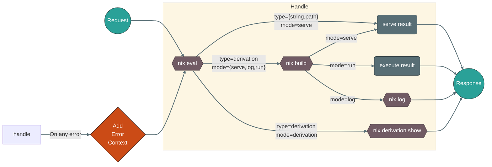

<div align="center" >
    

[](https://nixpresso.dev)
[](https://github.com/stv0g/nixpresso/actions)
[](https://goreportcard.com/report/github.com/stv0g/nixpresso)
[](https://app.codecov.io/gh/stv0g/nixpresso)
[](https://github.com/stv0g/nixpresso/blob/main/LICENSE)

[](https://pkg.go.dev/github.com/stv0g/nixpresso)
[](code_of_conduct.md)
[](https://liberapay.com/stv0g/donate)
</div>

Nixpresso is a HTTP server delegating request handling to a Nix function:

```nix
{
    query ? { user = "stv0g"; }
}: {
    body = "Hello ${query.user}";
}
```

Nixpresso's HTTP server is written in Go, while as much as possible of request handling is implemented in Nix.
Nixpresso uses the [NixCpp](https://github.com/NixOS/nix) evaluator and store for serving evaluated Nix expressions, build outputs, build logs, derivations or runs executables in a CGI-fashion.

While probably not a good idea, Nixpresso could be used to build fully featured web-applications including supportrequest/response streaming, session stores, authentication and much more.

Check out the [demo](https://nixpresso.dev) for some of its potential use cases.

> [!CAUTION]
> Nix and by extension Nixpresso have not undergone comprehensive security testing to ensure resilience against the full spectrum of potential remote attack vectors. In partiuclar starting Nixpresso `--allow-mode run` can expose your system to remote code execution. Evaluations and builds are performed on the hosts Nix store which could expose sensitive information or allow attackers to poision store contents.
> I currently recommend to run Nixpresso in a VM or sandboxes (e.g. systemd).

## Flowchart

This depicts Nixpresso's flow for request handling:



## Features

- Serves artifacts in response to user initiated HTTP requests:
  - Evaluated expressions (`nix eval`)
    - Only for strings or JSON-serializable values
  - Build outputs (`nix build`)
    - A single file
  - Build logs (`nix log`)
  - Derivations (`nix derivation show`)
    - Also recursively
  - Execution of outputs (`nix run`)
    - Optionally in Pseudo-terminals (PTYs)

- Efficient serving of local files via [`splice(2)`](https://man7.org/linux/man-pages/man2/splice.2.html).
- NixOS Module & Test
- Flake & Flake-less mode
- Pure & impure evaluation
- Caching of pure evaluation results
- Built-in TLS HTTP server
  - Passes TLS connection state to Nix handler for mutual TLS authentication.


- Supports most standard HTTP features:
  - Range requests (`Range` header)
  - Caching (`Cache-Control`, `ETag`, `If-None-Modified`, `If-Not-Modified-Since` headers)
  - MIME Type handling (`Content-Type` header)
  - Timing information (`Server-Timing` header)
  - Request & Response bodies
  - Request & Response body streaming

- Included library functions (`nixpresso.lib`)
  - URL en- & decoding
  - Query-string / HTML Form & Cookie parsing
  - HTTP statuses

- Included handlers (`nixpresso.lib.handlers`)
  - Serve paths (`.servePath`)
  - HTML rendering (`.html`)
    - Error page rendering (`.htmlError`)
  - Directory listings (`.directoryListing`)
  - Path-based router (`.router`)
  - HTTP redirects (`.redirect`)

- Hardening
  - Restrict accessible paths
    - Default is limited to `/nix/store`
  - Restrict request modes (`serve`, `log`, `derivation`)
  - Limit request & response body sizes
  - Limit evaluation, build and total request duration


## Use-cases

- Serve build results, e.g. CI artifacts
- Build your website/blog on-demand
- Nix evaluator playground
- Webhook handlers
    - CI

## Roadmap

- Better playground to demonstrate all features in single page.
- WebSockets for streaming standard stream of builds and execution using [Gorilla](https://gorilla.github.io/).
- Distributed evaluation cache using [TiKV](https://tikv.org/).
- Port to Rust using [Tvix](https://tvix.dev/).
- More integration and unit tests of Go and Nix code

## Usage

### General

```
Usage:
  nixpresso [flags] <handler> -- [nix-flags] -- [run-flags]

Flags:
  -m, --allow-mode mode             allowed response modes (default serve, log, derivation)
  -p, --allow-path path             allowed paths from which content can be served or executed
  -s, --allow-store                 allow serving or executing content from Nix store (default true)
  -t, --allow-type type             alowed response types (default string, path, derivation)
  -b, --base-path string            initial base path to pass to the handler
  -d, --debug                       enable debug logging
  -c, --eval-cache                  enable evaluation caching (default true)
  -h, --help                        help for nixpresso
  -L, --listen string               listen address (default ":8080")
      --max-build-time duration     maximum duration for the build phase. A zero or negative value means there will be no timeout (default 1m0s)
      --max-eval-time duration      maximum duration for the evaluation phase. A zero or negative value means there will be no timeout (default 1m0s)
      --max-read-time duration      maximum duration for reading the entire request, including the body. A zero or negative value means there will be no timeout (default 10m0s)
      --max-request-bytes int       maximum number of bytes the server will read from the request body (default 33554432)
      --max-request-time duration   maximum duration for the entire request (evaluation, building and running). A zero or negative value means there will be no timeout (default 1m0s)
      --max-response-bytes int      maximum number of bytes the server will serve in the response body (default 33554432)
      --max-run-time duration       maximum duration for the run phase. A zero or negative value means there will be no timeout (default 1m0s)
      --max-write-time duration     maximum duration before timing out writes of the response. It is reset whenever a new request's header is read (default 10m0s)
      --tls-cert string             TLS certificate file
      --tls-key string              TLS key file
  -v, --verbose int                 verbosity level (default -1)
      --version                     version for nixpresso
```


### Via Nix expression on the CLI

```shell
nixpresso -- --impure --expr 'let
  lib = import ./lib { };
in
lib.mkHandler { } {
  body = "Hello World";
}'
```

### With Flakes

The following command starts the Nixpresso server with a set of example handlers, passed as a Flake reference as the only argument:

```shell
nixpresso github:stv0g/nixpresso

# Or directly from Flake
nix run github:stv0g/nixpresso -- github:stv0g/nixpresso 
```

> [!IMPORTANT]  
> Nixpresso copies the Flake during startup to the Nix store. Changes to the Flake & handlers require a restart of Nixpresso.

> [!TIP]
> When started without any arguments, Nixpresso will look for a Flake in its working directory and use the attribute `.#handlers.<system>.default` as its handler.
> This allows you to run simply `nixpresso`.

### Without Flakes

```shell
nixpresso out -- --file ./handlers/default.nix

# Or directly from default.nix
nix run --file ./default.nix out -- default -- --file ./handlers/default.nix
```

> [!IMPORTANT]  
> Unless started with `-- --option pure-eval true`, Nixpresso will operate in impure mode. This will limit its caching ability and hence result in longer page load time.
> Please consider using Flakes.


#### Flake template

To get quickly started with implementing your own handlers, use our Flake template:

```shell
mkdir my-handler && cd my-handler

nix flake init -t github:stv0g/nixpresso
nix run
```

This creates a new flake containing a simple handler in `handler.nix` and a default package which starts Nixpresso with this handler.

## Handler interface

For each request, Nixpresso as a first step evaluates a Nix _handler_ function.
Request data is passed as an attribute set to the handler.
The handler returns either directly response data, or further instructions how the response should be generated (e.g. building a derivation).

> [!TIP]
> Have a look at [the existing example handlers](./handlers) to get started with your own.

### Request Arguments (_AttrSet_)

#### `proto` (_String_)

The HTTP protocol version.

#### `method` (_String_)

An string containing the request method in uppercase letters.

#### `uri` (_String_)

The full request URI.

#### `headers` (_AttrSet_[_List_[_String_]])

An an attribute set containing the request headers.

#### `host` (_String_)

The hostname as passed in the request.

This could be used to implement name-based virtual servers.

#### `path` (_String_)

#### `query` (_AttrSet_[_List_[_String_]])

#### `remoteAddr` (_String_)

A string containing the requesters IP address and port number separted by a colon.

#### `body` (_String_)

A string containing a store path to a single file which contains the request body.

#### `tls` (_AttrSet_)

- Client certificate
- Cipher
- TLS version
- and more...

#### `nixOptions` (_AttrSet_[_String_])

The `nixOptions` attribute set contains all Nix options passed via the `-- --option` CLI arguments.

#### `handler` (_String_)

The Flake reference and/or attribute of the current handler.

#### `basePath` (_String_)

A string containg a path prefix under which Nixpresso is serving.

Use the `-b`, `--base-path` CLI arguments to specify the initial base path.

Some included request handlers like the path-based routers will alter the base path passed to sub-handlers.

#### `error` (_AttrSet_)

In case an error occurs during evaluation, build or execution, Nixpresso will re-evaluate the handler and pass error information via the `error` attribute.

This allows the handler to gracefully handle bad requests by the user and render errors in a prettier way.


### Response Return Value (_AttrSet_)

#### `mode` (_StringEnum_ `serve`, `run`, `log`, `derivation`) = `"serve"`

One of the following values:

- `serve`: Build results, Nix strings or pre-existing files are returned in the response body.
- `run`: Build results or pre-existing executables are executed. The request body is passed to the standard input. The combined standard output and error streams are returned in the response body.
- `log`: The build logs of a derivation are returned in the response body.
- `derivation`: The derivation is returned in JSON-encoding in the response body.

> [!NOTE]  
> Which modes are supported is restricted by the `--allow-mode` CLI argument.

#### `type` (_StringEnum_ `string`, `derivation`, `path`) = _automatically determined_

The `type` attribute defines the interpretation of the `body` attribute.
The following values are allowed:

- `string`: The `body` attribute contains a string which should be directly returned as the response body.
- `derivation`: The `body` attribute contains a path to a derivation in the Nix store.
- `path`: The `body` attribute contains a pre-existing path: either in the Nix or somewhere else on a local filesystem.

> [!NOTE]  
> Which types are supported is restricted by the `--allow-type` CLI argument.

> [!NOTE]  
> Which paths are accessible for `type = path` restricted by the `--allow-path` CLI argument.

#### `status` (_Integer_)

The HTTP status code which will be returned.

#### `headers` (_AttrSet_[_List_[_String_]]) = `{ }`

An attribute set of HTTP headers which will be returned.

#### `body` (_String_) = `""`

The response body which will be returned. Interpretation is defined by the `mode` and `type` attributes.

#### `subPath` (_String_) = `""`

Path of an executable or regular file within the build output which should be executed or served.

#### `args` (_List_[_String_]) = `[ ]`

**Valid in modes:** `run`

Arguments which are passed to the process when executed.

#### `env` (_AttrSet_[_String_]) = `{ }`

An attribute set of environment variables which will be passed to the process when executed.

#### `output` (_String_) = `out`

The derivation output from which the response is generated.

#### `recursive` (_Bool_) = `false`

JSON-encoded derivations are returned recursively.

Equivalent to `nix derivation show --recursive`.

**Valid in modes:** `derivation`

#### `rebuild` (_Bool_) = `false`

Derivation outputs will be rebuild, even if they already exist locally.

Equivalent to `nix build --rebuild`.

#### `pty` (_Bool_) = `false`

Evaluation, builds and command execution will be performed in a pseudo-terminal.

#### `stream` (_Bool_) = `true`

The response body streamed directly from the invoked sub-processes (`nix build`, `nix log`, ...).

> [!IMPORTANT]  
> When enabled, the HTTP status code is always 200-OK as HTTP headers have been already sent when non-zero exit codes are observed.

## Library

Nixpresso comes with a set of useful functions for implementing a handler.

- [Library Documentation](./docs)

## Related Projects

- [replit: Building a web app with Nix (Because why not?)](https://blog.replit.com/nix_web_app)
- [tvl: Bubblegum — a nix CGI programming framework](https://discourse.nixos.org/t/bubblegum-a-nix-cgi-programming-framework/12259) ([Code](https://code.tvl.fyi/tree/web/bubblegum/README.md))
- [styx: Static site generator in Nix expression language](https://github.com/styx-static/styx)

## Donations

I develop and maintain this project with a passion in my spare time.
If you find it useful and would like to support its continued development, consider making a voluntary donation.
Your contributions help cover hosting and development costs, enhance features, and ensure long-term maintenance.

Every contribution, big or small, makes a difference. Thank you for your support!

[](https://liberapay.com/stv0g/donate)

## Sponsoring

Since hosting this application can be quite resource intensive, I am looking for sponsors which can support me in running [https://nixpresso.dev](nixpresso.dev).

Please [approach me](https://github.com/stv0g#contact) if you or your employer is interested.

## Authors

- [Steffen Vogel (@stv0g)](https://github.com/stv0g)

## License

Nixpresso is licensed under the [Apache 2.0](./LICENSE) license.

- SPDX-FileCopyrightText: 2023-2025 Steffen Vogel <post@steffenvogel.de>
- SPDX-License-Identifier: Apache-2.0